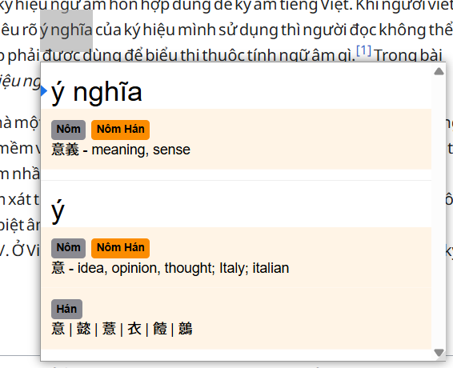

# 喃字漢字字典 A Chữ Nôm and Chữ Hán Dictionary for Yomitan

Data of Chữ Hán come from [MaigoAkisame/MCPDict](https://github.com/MaigoAkisame/MCPDict).

Data of Chữ Nôm come from [chunom.org](https://chunom.org/), and a packed Chữ Nôm dictionary for Yomitan can be found [here](https://www.mediafire.com/file/sn5xjfcp045vh9p/Ch%E1%BB%AF_N%C3%B4m.zip/file).
The dataset of Chữ Nôm is far from complete, it only contains less than 2,000 entries. Many common words are still missing.
